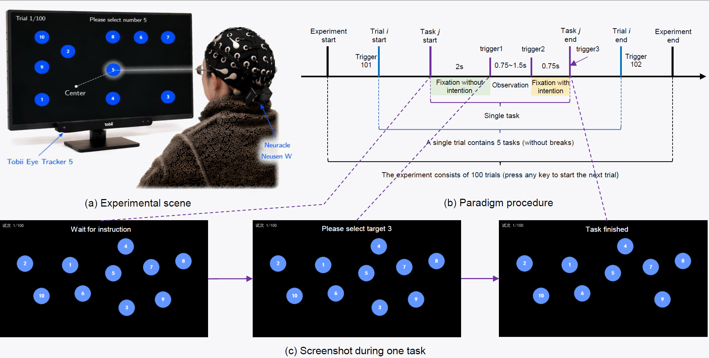
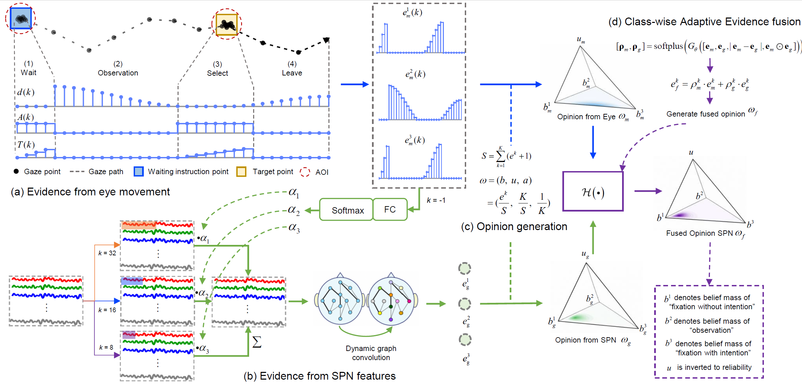

## Code for Paper "EviSET: Evidence-Driven Target Selection with Eye Movements and Stimulus-Preceding Negativity for Rapid and Reliable Interaction"

This repository contains the preprocessing, feature extraction, model evaluation, and result export code for EviSET, an evidence-driven target selection method that fuses eye-movement evidence and EEG stimulus-preceding negativity (SPN) features.

### Abstract

Gaze-based interaction enables intuitive target selection without manual input, but distinguishing visual attention from intentional selection remains difficult. Existing solutions rely on explicit confirmation, such as dwell-time or auxiliary motor actions, which mitigate unintended selections at the cost of slower interaction, additional effort, and reduced naturalness. In this work, we first designed a brain-eye collaborative target selection (BECoTS) paradigm and record a multimodal electroencephalography (EEG) and eye movement dataset. To make more rapid and reliable interaction, an evidence-driven opinion representation and fusion (EviSET) method was proposed to decode asynchronous eye movement and EEG signals for efficient target selection. Specifically, EviSET constructs modality-specific evidence from eye trajectories and anticipatory stimulus-preceding negativity (SPN) features, capturing explicit spatial attention from eye movements and implicit intention-related anticipatory processes from EEG. These complementary sources of evidence are mapped into subjective opinions and adaptively fused according to their estimated reliability, enabling robust early decision-making. Experimental results show that EviSET achieves a favorable balance between target-selection speed and recognition accuracy, thereby improving system responsiveness and user experience.

### Overview



Details of the BECoTS paradigm: (a) experimental scene; (b) paradigm procedure; and (c) representative screenshots during one task.



Pipeline of EviSET: (a) evidence from eye movement signals; (b) evidence from SPN features; (c) opinion generation; and (d) opinion fusion.

### Repository Structure

```text
.
|-- main.py                  # Unified command-line entry point
|-- task/
|   |-- preprocess.py        # Raw EEG/gaze preprocessing
|   |-- test.py              # Evaluation runner
|   |-- train.py             # Feature extraction, splits, and method registry
|   `-- metric.py            # Metrics and CSV result export
|-- model/                   # Baseline and EviSET model implementations
|-- scripts/                 # Compatibility wrappers
|-- image/                   # README figures
`-- data.py                  # Legacy data loading utilities
```

### Requirements

The code is written in Python and depends on the following main packages:

```bash
pip install numpy pandas scipy scikit-learn mne torch matplotlib
```

Install the PyTorch build that matches your CUDA or CPU environment from the official PyTorch instructions if the generic command is not suitable for your machine.

### Raw Data Layout
The data can be found at https://www.alipan.com/s/kptSVTdNudq. 
The preprocessing script expects one folder per subject:

```text
raw_data/
`-- S01/
    |-- Neuracle/
    |   |-- data.bdf
    |   `-- evt.bdf
    |-- target_loc.npy
    `-- trial_data/
        `-- *_gaze_samples.csv
```

Each gaze CSV must include at least the columns `time`, `x`, `y`, and `trigger`.

### Preprocessing

Run preprocessing for all available subjects:

```bash
python main.py preprocess --raw-dir raw_data --out-dir processed_data --overwrite
```

Run preprocessing for selected subjects or task slots:

```bash
python main.py preprocess --subject S01 S02 --task 1 3 --overwrite
```

The preprocessing step writes five early-prediction datasets:

```text
processed_data/
|-- horizon_500ms/
|-- horizon_400ms/
|-- horizon_300ms/
|-- horizon_200ms/
`-- horizon_0ms/
`-- manifest.csv
```

Each subject file is saved as `.npz` and contains EEG windows, eye-movement windows, labels, subject/trial/task metadata, trigger IDs, event times, and target coordinates.

### Evaluation

Run the default evaluation with both within-subject and cross-subject protocols:

```bash
python main.py test --data-dir processed_data --out-dir results --protocol both
```

Run a quick smoke test with selected methods:

```bash
python main.py test --data-dir processed_data --out-dir results_smoke --protocol within --quick --methods SVM Ours
```

Evaluate selected subjects or task slots:

```bash
python main.py test --subject S01 S02 --task 1 3 --model SVM EEGNet --protocol within
```

Supported protocols:

- `within`: split each subject internally.
- `cross`: leave-one-subject-out evaluation.
- `both`: run both within-subject and cross-subject protocols.
- `pooled`: mixed-subject split for compatibility with older experiments.

### Methods

The evaluation registry includes eye-only, EEG-only, and multimodal fusion methods:

```text
SVM, TCN, DeepConvNet, EEGNet, EEGInception, MTCN, PhyTransformer, STSGCN, MSNet, MTNet, DES, TMVDL, RCML, Ours
```

Use `--methods` / `--models` / `--model` to select a subset.

### Outputs

Evaluation outputs are written as CSV files:

```text
results/
|-- table_results.csv
|-- within_subject_summary.csv
|-- cross_subject_summary.csv
`-- pooled_summary.csv
```

The exact files depend on the selected protocol. Metrics include accuracy and macro-F1 for the 500 ms, 250 ms, and 0 ms early-prediction horizons.

### Notes

- Labels are encoded as `0` for fixation without selection intention, `1` for observation, and `2` for fixation with selection intention.
- By default, auxiliary ECG/EOG channels are excluded during preprocessing.
- Use `--no-filter` or `--no-zscore` only for debugging or smoke tests.
- Use `--quick` for faster evaluation during development; it is not recommended for final reported numbers.

### Citation

Citation information will be added after publication.

### License

Please check the project or paper release notes for licensing and data access terms.
